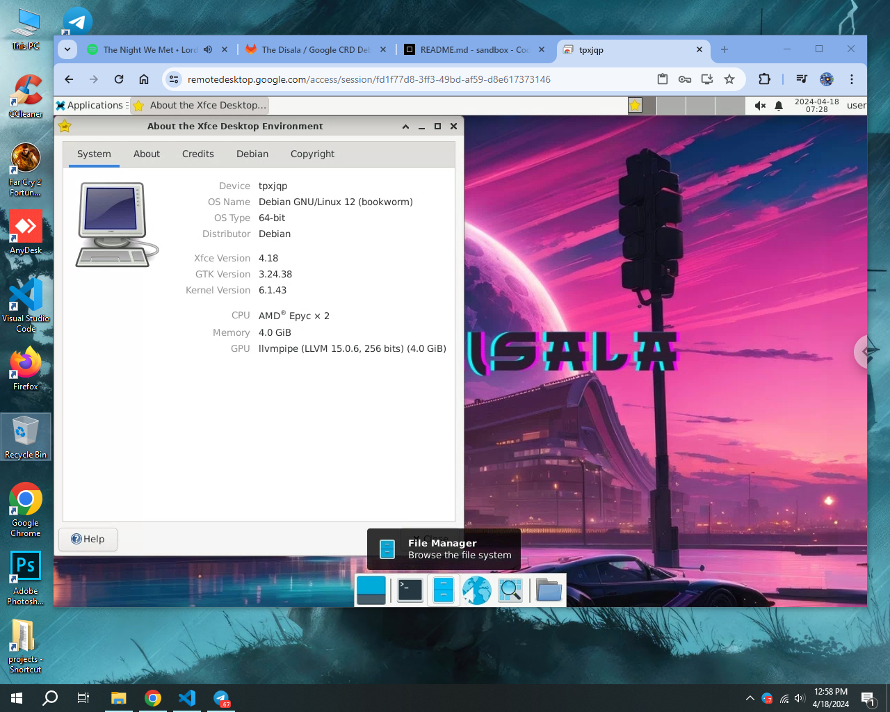

# GPU RDP METHOD

## Debian CodeSandBox RDP ft Google Chrome Remote Desktop (GCRD)

# Read This Before Rushing To Download workflow 💀

* i'm **not responsible** for **suspended Google accounts**
* **Don't try these in your personal Gmail account** 
* **Don't CrYptO mine , Instant Ban**

---
### Debian GNU/Linux 12 (bookworm)

VM features:
* Kernel Version: 6.1.43
* CPU: AMD Ерус х 2 / 4
* Memory: 4.0 GiB / 8.0 GiB
* GPU: Ilvmpipe (LLVM 15.0.6, 256 bits) (4.0 GiB)
* 10GiB Disk 
* We Have Some Cool Features That Other workflows Dosen't Have
  - Automatically Chrome Installed
  - Automatically Telegram Installed
  - Automatically Qbittorrent Installed
  - Removed Stupid/Unrated Softwares
  - Added New Wallpaper
  - Ect ...

## Deploy and Run

    
Ubuntu RDP Install and Run

 
    
+ **create codesandbox.io account**
  - go to **codesandbox.io** or [**click here**](https://codesandbox.io/)
  - now click **signin** with **github** (if u dosen't have github account make new one **or choose other option**)
  - fill user name and'ol then click create account
  - also complete steps it easy !

+ **create dev box in codesandbox**
  - click **+ Devbox** button in right up corner
  - click all templates and chose **python**
  - chose what **runtime** you want , i'm going with defualt
  - now click **create devbox**
  - now in bottom center click terminal/shell button and create new terminal

+ **download the code file**
  - **just download it from the release or [click here](https://bit.ly/codesandbox-crd-rdp)**
  - open the downloaded text file and copy all the code

+ **go back to devbox terminal/shell**
  - paste the copied code in to the terminal/shell you just opened
  - hit enter

+ **get you google crd shell code**
  - go to **remotedesktop.google.com** or [**click here**](https://remotedesktop.google.com/headless)
  - now **click begin > next > authorize > click copy button in Debian Linux**

+ **go back to devbox terminal/shell**
  - paste the copied code in there 
  - hit enter , then wait few minutes
  - after banner pop up named **MR ZAIN** ,it means all done !

+ **use RDP**
  - go to **google crd** or [**click here**](https://remotedesktop.google.com/access)
  - _then you can see your rdp in there_
  - **enjoy :)**

How much time actually this rdp works ?

**It's upto you** , if u choose **runtime as higher** then your **free 400 credits** will spent **faster**. casue here some **calculations**

<table>
  <thead>
    <tr>
      <th>Usage Time</th>
      <th>Runtime</th>
      <th>Estimated Credits</th>
      <th>Total Fun Time</th>
    </tr>
  </thead>
  <tbody>
    <tr>
      <td>1 hour</td>
      <td>2 core</td>
      <td>10</td>
      <td>40 hours</td>
    </tr>
    <tr>
      <td>1 hour</td>
      <td>4 core</td>
      <td>20</td>
      <td>20 hours</td>
    </tr>
  </tbody>
</table>

Can i crypto mine in these rdp's ?

**No !**
 

it will **instantly ban you** with your **ip address and email name**.
 

_i mean by email name its email name 
ex. rdp84596@gmail.com and the email name is MRZAIN or ZAIN. they will ban accounts that have same name to the email._

# [Watch Tutorial If You Dosen't Understand This.](https://youtube.com/mrcyber11rdp)

### Brought To You By MR ZAIN 💀 , Its Functional 😗.
### You Can See ID , Username , Pass , Pc Name And Cool Ascki Art 